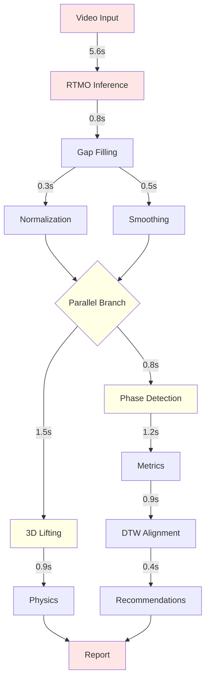
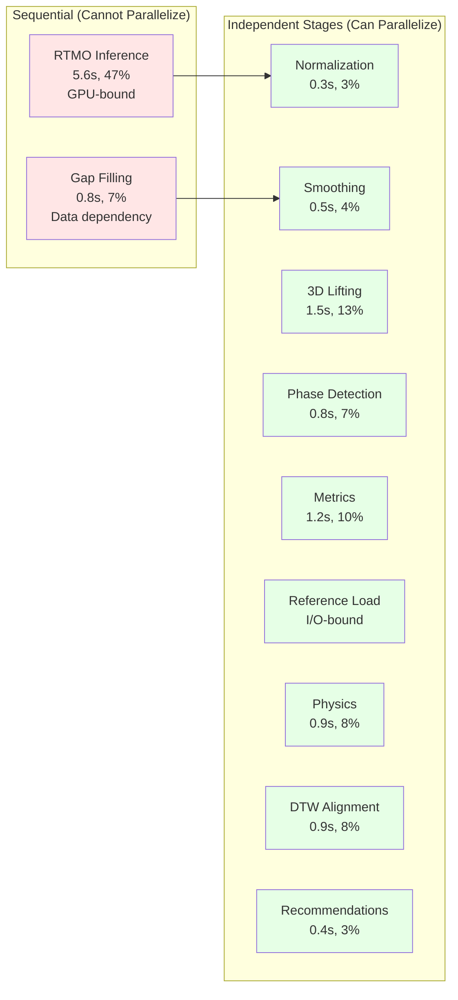
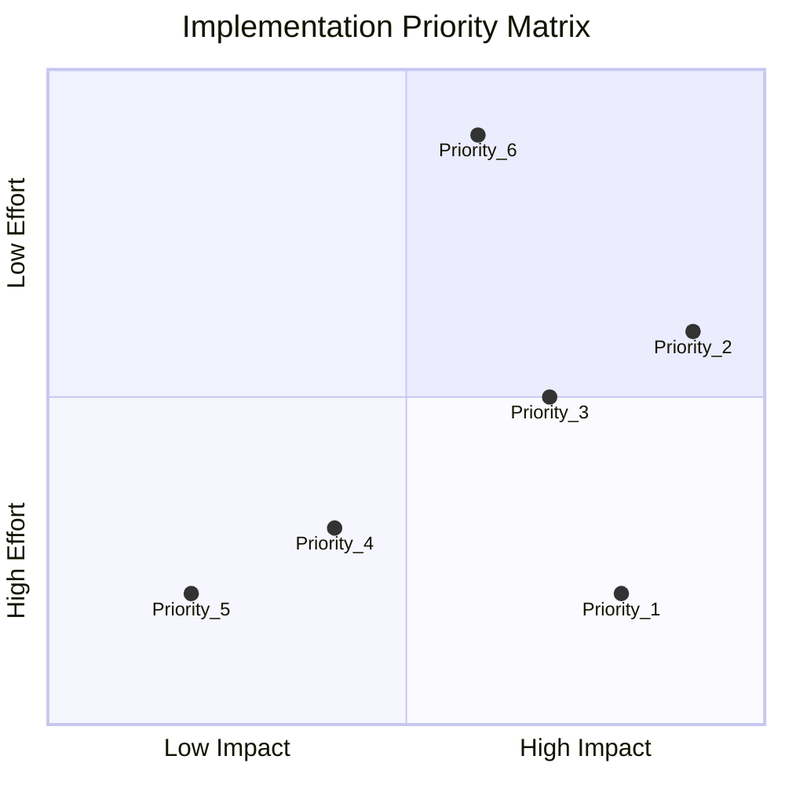
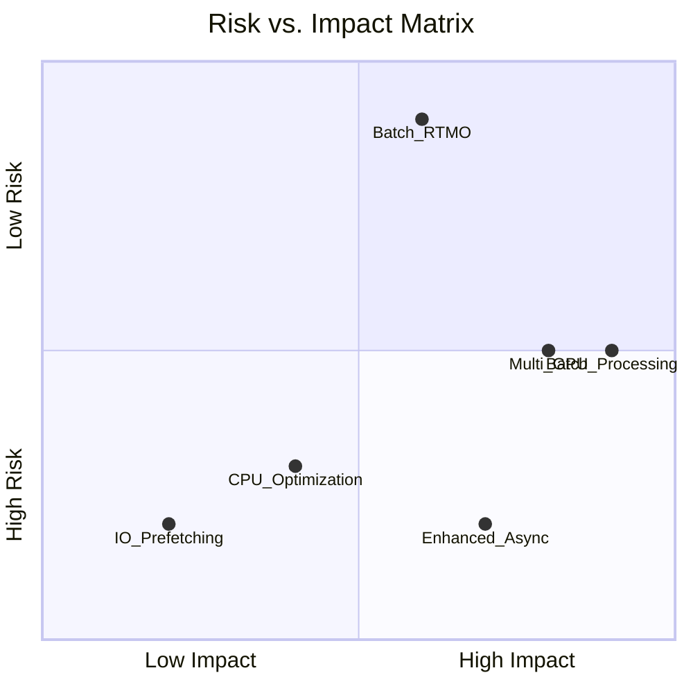
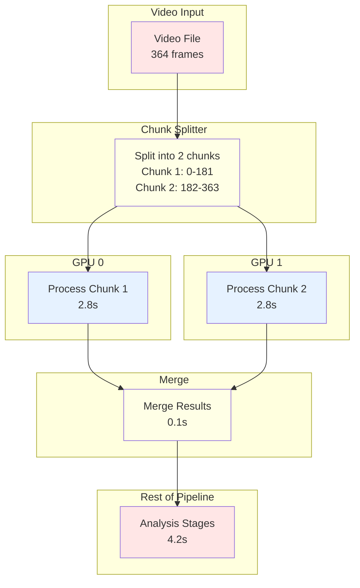
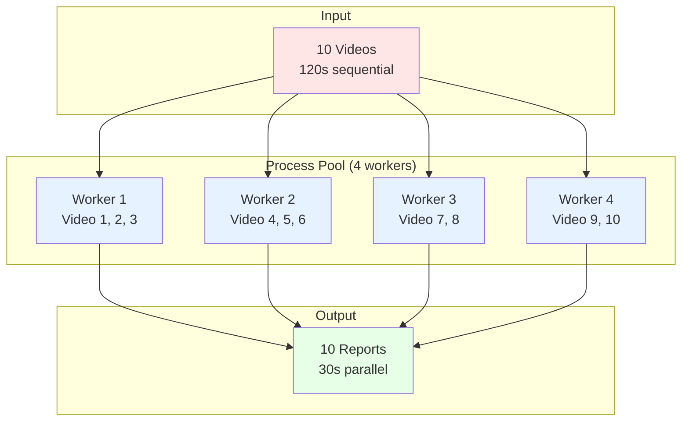
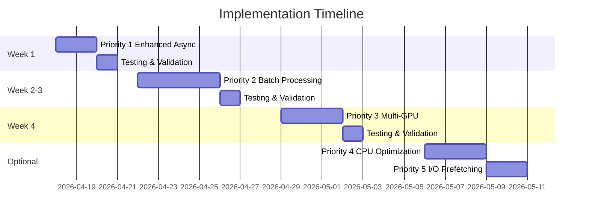

# Pipeline Parallelization - Visual Diagrams

## Current Pipeline (Sequential)

```mermaid
gantt
    title Current Pipeline (Sequential) - Total: 12.0s
    dateFormat X
    axisFormat %L

    section Extraction
    RTMO Inference       :crit, 5.6s, rtm
    Gap Filling          :0.8s, after rtm, gap
    Normalization        :0.3s, after gap, norm
    Smoothing            :0.5s, after norm, smooth

    section Analysis
    3D Lifting           :1.5s, after smooth, lift
    Phase Detection      :0.8s, after smooth, phase
    Metrics              :1.2s, after phase, metrics
    Reference Load       :after metrics, ref
    DTW Alignment        :0.9s, after ref, dtw
    Recommendations      :0.4s, after dtw, rec
```

## Proposed Pipeline (Parallel)

```mermaid
gantt
    title Proposed Pipeline (Parallel) - Total: 10.0s
    dateFormat X
    axisFormat %L

    section Extraction
    RTMO Inference       :crit, 5.6s, rtm
    Gap Filling          :0.8s, after rtm, gap

    section Parallel 1
    Normalization        :0.3s, after gap, norm
    Smoothing            :0.5s, after gap, smooth

    section Parallel 2
    3D Lifting           :1.5s, after norm lift, lift
    Phase Detection      :0.8s, after smooth phase, phase

    section Parallel 3
    Metrics              :1.2s, after phase metrics, metrics
    Reference Load       :after phase ref, ref
    Physics              :0.9s, after lift physics, physics

    section Parallel 4
    DTW Alignment        :0.9s, after metrics dtw, dtw
    Recommendations      :0.4s, after metrics rec, rec
```

## Critical Path Analysis



## Parallelization Opportunities



## Performance Comparison

```mermaid
graph BAR
    title Single Video Performance (364 frames)
    x-axis ["Current", "Priority 1", "Priority 1+3", "All"]
    y-axis "Time (seconds)" 0 --> 12
    bar [12.0, 10.0, 5.0, 4.2]
```

## Batch Processing Scaling

```mermaid
graph LINE
    title Batch Processing Speedup
    x-axis "Workers" 1 --> 8
    y-axis "Speedup (x)" 0 --> 8
    line [1.0, 2.0, 3.8, 4.0, 4.2, 4.5, 4.8, 5.0]
```

## Implementation Priority Matrix



## Risk vs. Impact Matrix



## Multi-GPU Architecture



## Batch Processing Architecture



## Timeline



---

**End of Visual Diagrams**
